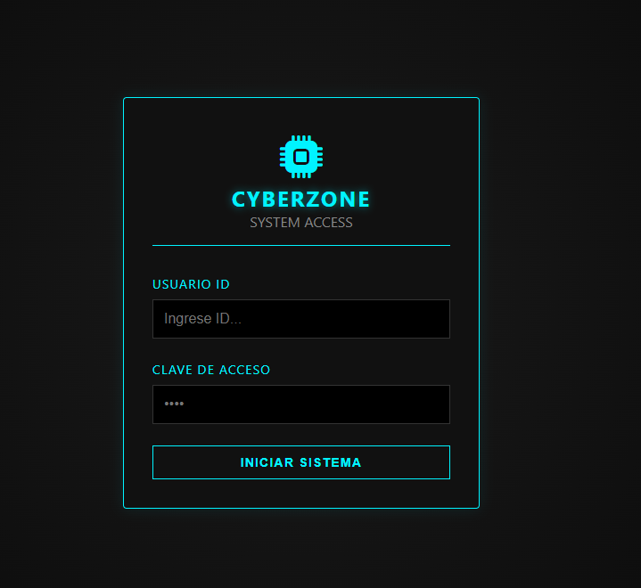
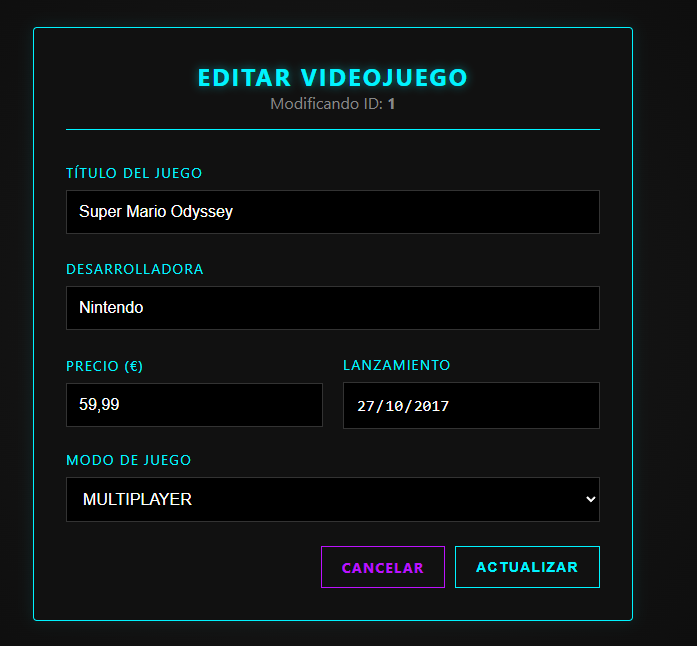

# GameZone - Sistema CRUD MVC


GameZone es una aplicación web robusta para la gestión integral de un catálogo de videojuegos. Este proyecto ha sido desarrollado implementando una arquitectura MVC (Modelo-Vista-Controlador) estricta, utilizando PHP nativo sin frameworks y un diseño de interfaz personalizado.

## Galería del Proyecto

### 1. Control de Acceso (Login)
Interfaz minimalista con validaciones en tiempo real y seguridad de sesiones.


### 2. Panel de Administración (Dashboard)
Gestión centralizada con tabla responsive, buscador integrado y notificaciones del sistema.


### 3. Gestión de Datos (CRUD)
Formularios dinámicos para la creación y edición de registros, reutilizando componentes visuales.


## Arquitectura y Tecnologías

El proyecto demuestra el dominio de los fundamentos del desarrollo web backend y frontend:

### Backend (PHP & MySQL)
* **Patrón MVC:** Separación lógica estricta entre Controladores (lógica), Modelos (datos) y Vistas (interfaz).
* **PDO (PHP Data Objects):** Capa de abstracción de base de datos segura.
* **Seguridad:**
    * Prevención de inyección SQL mediante sentencias preparadas.
    * Protección de rutas directas y gestión de constantes de seguridad.
    * Saneamiento de entradas de usuario.
* **Sesiones:** Sistema de autenticación y persistencia de usuario.

### Frontend (CSS & JS)
* **CSS Puro:** Diseño construido desde cero usando Flexbox y CSS Grid. No se utilizan librerías externas como Bootstrap.
* **Diseño Visual:** Uso de variables CSS para gestión de paleta de colores y modo oscuro (temática Cyberpunk).
* **JavaScript Nativo:** Validaciones en el lado del cliente para mejorar la experiencia de usuario antes de enviar peticiones al servidor.

## Estructura del Directorio

El proyecto sigue una organización de archivos modular y escalable:

```text
GameZone/
├── config/
│   └── Database.php       # Conexión Singleton a BD (PDO)
├── controllers/
│   ├── LoginController.php # Gestión de autenticación
│   └── JuegoController.php # Lógica CRUD y Buscador
├── models/
│   ├── Usuario.php        # Acceso a datos de Usuarios
│   └── Juego.php          # Acceso a datos de Videojuegos
├── views/
│   ├── login.php          # Vista de acceso
│   ├── dashboard.php      # Vista principal (Listado)
│   ├── create.php         # Vista de alta
│   └── edit.php           # Vista de edición
├── css/
│   └── style.css          # Hoja de estilos global
├── js/
│   └── validaciones.js    # Lógica de validación cliente
├── img/                   # Recursos gráficos y capturas
└── index.php              # Controlador frontal (Enrutador)